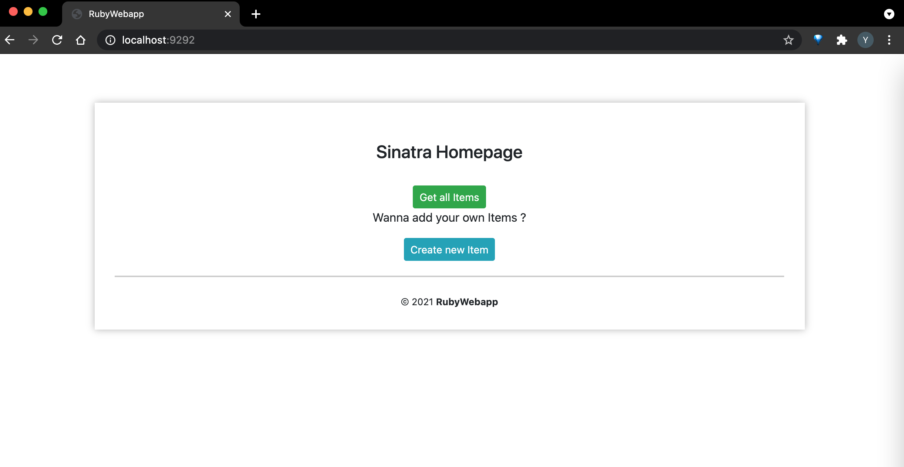
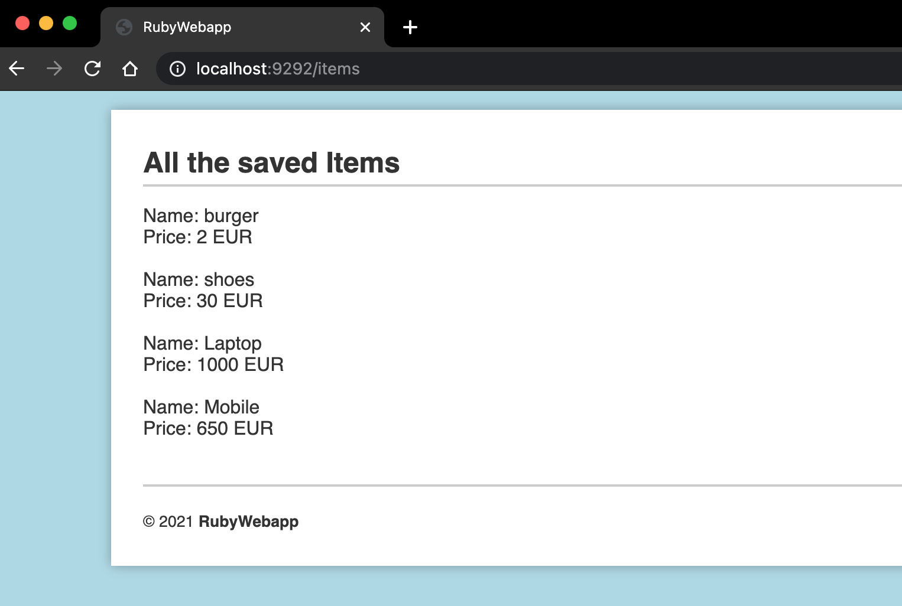
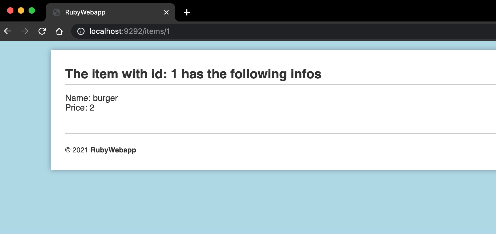
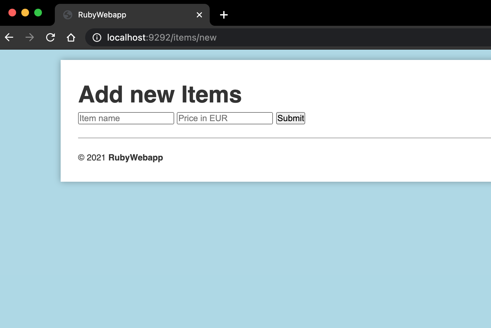

# ruby-simple_webapp
By using this app you can **create new Items** and save them in Database using POST method.
You can also **return ALL saved Items** or **an Item** by finding it through it's own id.
The App is based on **MVC Architecture** using **_corneal_** Rails like template.

## Index
1. [GUI_Version](#1-gui_version)
2. [no_GUI_Version](#2-no_gui_version)

# 1. GUI_Version
  
## Installation
Clone the Repository then open the folder and head to `ruby-webapp` using your terminal.
Run `bundle install`

## Run
Run `rackup` and enter the following URL using your browser: `http://localhost:9292/`. 
You Colud run `shotgun` instead **_For Developing Purposes_** to automatically render the project while editing it. But then you'll need to use port `9393` instead of `9292`.

## Examples
View of the **homepage**

  
   

Returning **all Items**

  
   

Returning **one Item** using it's own id

  
   

View of **add form**

  
   

# 2. no_GUI_Version
In case you wanted to use curl in your terminal and get your data back as JSON, you need to use the modified no_GUI version of the Webapp.
to do so head to `ruby-webapp_no_gui`. Run `bundle install`. 
Now you can GET and POST your JSON data as following: 

### Return all Items as JSON
`curl localhost:9292/items`

### Return one Item as JSON
`curl localhost:9292/items/id_of_the_item`

### Post an Item as JSON 
`curl -X POST http://localhost:9393/items -d '{"name": "Test", "price": 123}'`

