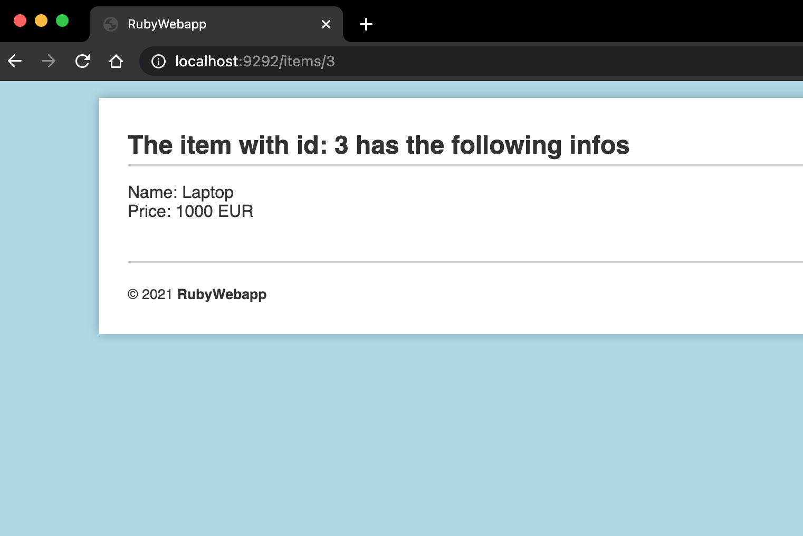

# test-ruby_webapp
By using this app you can **create new Items** and save them in Database using POST method.
You can also **return ALL saved Items** or **an Item** by finding it through it's own id.
The App is based on **MVC Architecture** using **_corneal_** Rails like template.
## Installation
Clone the Repository then open the folder and head to `ruby-webapp` using your terminal.
Run `bundle install`

## Run
Run `rackup` and enter the following URL using your browser: `http://localhost:9292/`. 
You Colud run `shotgun` instead **_For Developing Purposes_** to automatically render the project while editing it. But then you'll need to use port `9393` instead of `9292`.

## Examples
View of the **homepage**

  
   

Returning **all Items**

  
   

Returning **one Item** using it's own id

  
   

View of **add form**

  
   

